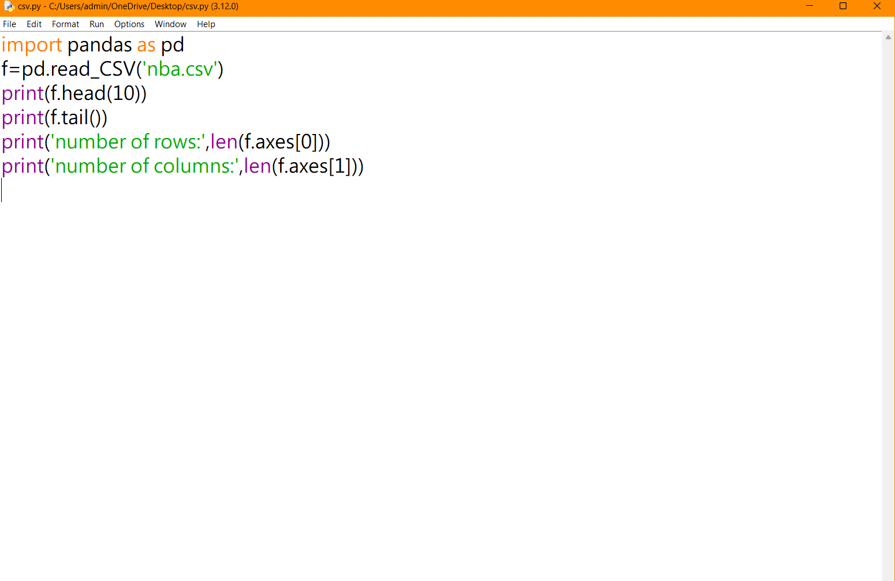
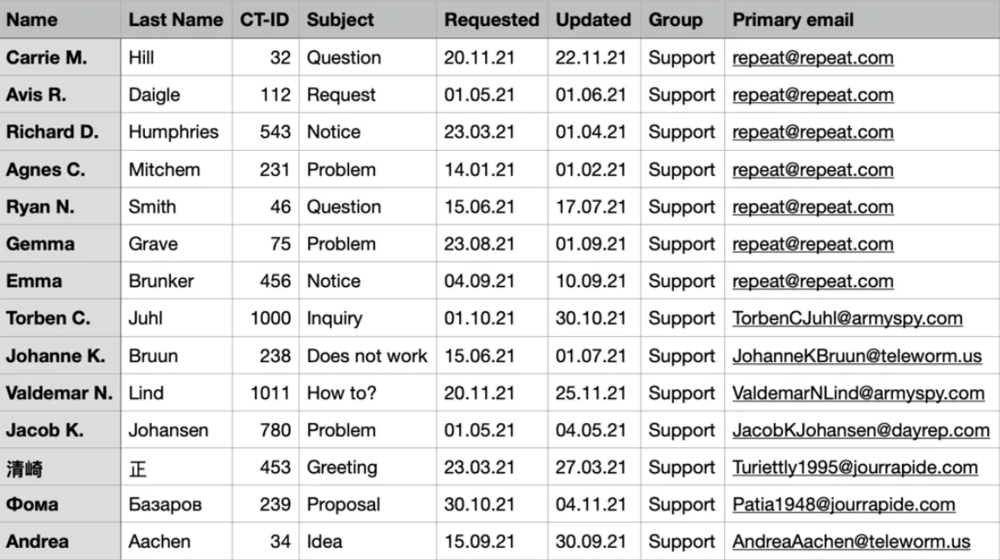

# Read-from-CSV

## AIM:
To write a python program to read contents from a csv file


## ALGORITHM:
### Step 1:
import pandas as pd
### Step 2:
Using pd.read_csv method read the csv file .
### Step 3:
Using df.head print the first 10 rows of the csv file
### Step 4:
using df.tail()  print the last 5 rows of the csv file
### Step 5:
using len(df.axes[]) print the total number of rows and columns with argument 0 for row and argument 1 for column

## PROGRAM:
```
import pandas as pd
f=pd.read_CSV('nba.csv')
print(f.head(10))
print(f.tail())
print('number of rows:',len(f.axes[0]))
print('number of columns:',len(f.axes[1]))
```


## OUTPUT:




## RESULT:
